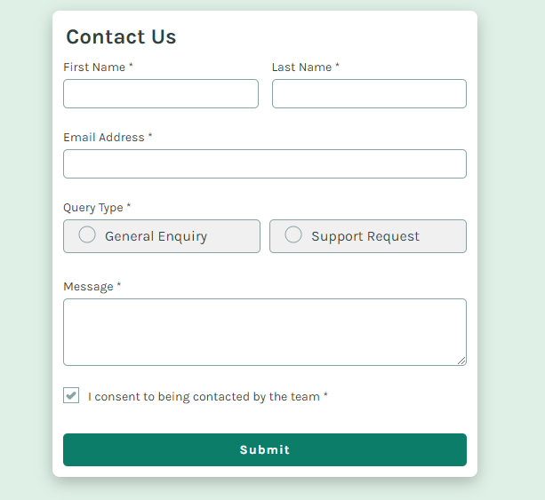

# Contact Form

Este projeto é um formulário de contato simples que permite aos usuários enviar suas informações de contato e mensagens. O formulário inclui validação de campos, feedback visual e confirmação de envio.

## Demonstração



## Tecnologias Utilizadas

- HTML
- CSS
- JavaScript

## Estrutura do Projeto

- `index.html`: Arquivo principal contendo a estrutura do formulário.
- `assets/images/...`: Imagens do projeto.
- `assets/fonts/...`: Fontes do projeto.
- `src/css/reset.css`: Reset de estilos padrão dos navegadores.
- `src/css/variables.css`: Variavéis utilizadas. 
- `src/css/main.css`: Estilos principais.
- `src/css/name-information.css`: Estilos da div de nome.
- `src/css/query-type.css`: Estilo da div query type.
- `src/css/consent.css`: Estilo do consent.
- `src/css/submit-btn`: Estilo do botão de envio.
- `src/css/error-styles.css`: Estilos de erro.
- `src/css/sucess-state.css`: Estilos da mensagem de sucesso.
- `src/css/responsive.css`: Estilos responsivos para diferentes telas.
- `src/js/index.js`: Script de validação de formulário.

## Como Usar

1. Clone o repositório:
   ```bash
   git clone <URL_DO_REPOSITORIO>

2. Navegue até o diretório do projeto:
    ```bash
    cd project-directory

3. Abra o arquivo index.html em seu navegador.

## Funcionalidades

- Validação de Campos: O formulário verifica se todos os campos obrigatórios estão preenchidos corretamente antes de permitir o envio.
- Feedback Visual: Mensagens de erro são exibidas se os campos não forem preenchidos corretamente.
- Consentimento: O usuário deve consentir em ser contatado para que o formulário seja enviado.
- Mensagem de Sucesso: Uma mensagem de confirmação é exibida após o envio bem-sucedido do formulário.

## Notas:
- Substitua `<URL_DO_REPOSITORIO>` pela URL real do seu repositório.
- Adicione uma captura de tela do formulário na seção de demonstração, se desejar.
- Atualize os detalhes de contato conforme necessário.